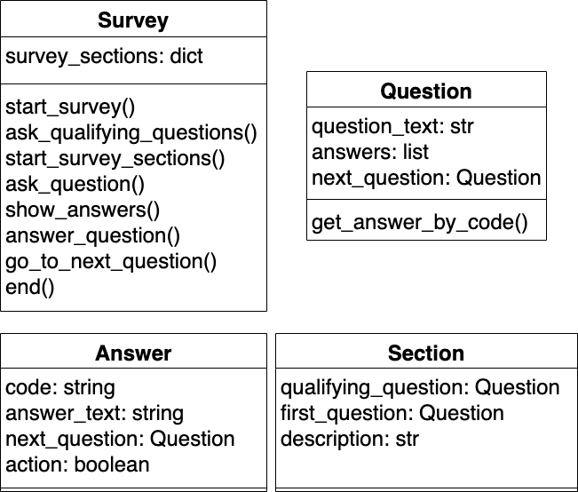

# Week 6 Task

# SheCodes Plus Survey

Your task is to create a program that conducts a survey about SheCodes Plus.

## Requirements:

- Must use OOP. You should build your program in a modular way, so that once you have the basic structure set up, it is easy to add additional questions and/or sections.
- There must be at least 3 sections of the survey. Each section must have a title and description, and a minimum of 3 multichoice questions.
- There must be a series of qualifying questions that the user is asked first. The users answers will decide which survey sections they will be asked to complete. (e.g. to answer the meerkat section of the survey, they must like meerkats).
- Each question will consist of the question text followed by a minimum of 2 answers for the user to choose between. The user will select their answer by typing in the code that corresponds to the answer, as given by your program.
- The user must be forgiven for any incorrect input (i.e. your program must handle incorrect user input).
- The survey must be about SheCodes Plus. Ideas for sections of the survey to get you started:
  - How the user feels about the Wednesday night classes
  - How the user feels about the Saturday morning classes
  - The user’s thoughts on mentors so far
- Think about the user. Give them prompts to help them understand what input the program is expecting, make your output clear and concise, providing titles, descriptions and blank space where necessary.

## Extra for experts:

- At the end of the survey give the user the option to return to the beginning of the survey, or end the program.
- Conditional answers e.g. question three depends on the user’s answer to the second question.
 - Throw a random element in there! Randomly give a bonus question, at a maximum of one bonus question per survey.
- Record the user’s answers and give a summary at the end of the survey.

## Tips

A UML diagram is attached to give you a starting point for your code structure. This is not the only way to structure your code (I think it can be improved upon substantially!), but it is a good place to start if you are unsure of what to do.

To read the diagram:
- Each table represents a class
- The first row is the name of the class
- The second row is the attributes (and their type) of the class
- The third row are the methods for that class.

